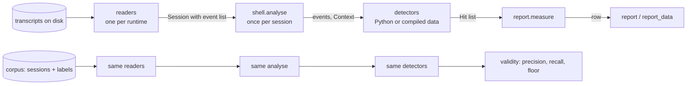
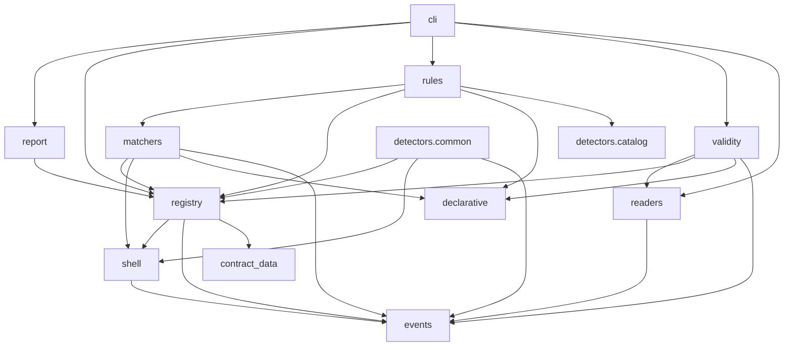
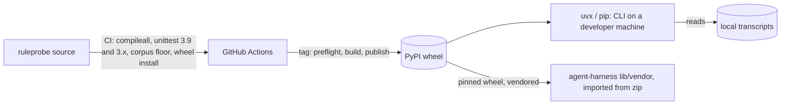

# Architecture Spine: ruleprobe

Every rule below is tagged. `[ADOPTED]` means the 0.1.0 code already does it (implemented, 0.1.0).
`[PROPOSED]` means the rule binds v0.2.0 work that does not exist yet (planned, v0.2.0). Inferences carry
`[ASSUMPTION: ...]`. Rationale is in `.memlog.md` beside this file.

## Design Paradigm

**Pipes and filters, batch per session.** `iter_sessions` streams sessions. Inside a session the event
list is materialised, parsed once, and handed whole to every detector, because session matchers
(`order`, `absent`, `change`) read the whole list. A detector is a filter from that list to hits. A row is
a session's hits reduced to counts. The report and the validity scorer are two sinks over the same
filters.



| Layer | Modules |
| --- | --- |
| Schema (leaf) | `ruleprobe/events.py` |
| Format (leaf) | `ruleprobe/declarative.py` |
| Parse | `ruleprobe/shell.py` |
| Engine | `ruleprobe/registry.py`, `ruleprobe/detectors/` |
| Compilers | `ruleprobe/matchers.py` |
| Binding | `ruleprobe/rules.py` |
| Sources | `ruleprobe/readers/` |
| Sinks | `ruleprobe/report.py`, `ruleprobe/validity.py` |
| Shell | `ruleprobe/cli.py`, `ruleprobe/__main__.py`, `ruleprobe/__init__.py` (re-exports) |

## Inherited Invariants

| Inherited | From parent | Binds here |
| --- | --- | --- |
| AD-13: detector logic lives in `ruleprobe` | [agent-harness spine](https://github.com/JakeSelby/agent-harness/blob/main/_bmad-output/planning-artifacts/architecture-spines/architecture-agent-harness-2026-09-23/ARCHITECTURE-SPINE.md) | The harness vendors a pinned wheel and never forks detector logic. A ruleprobe release means a harness bump. Declarative detectors are read through this engine. Here: AD-9 declares what the harness imports; no ruleprobe change may require the harness to copy detector code. |
| AD-21: dependencies | same | Standard library first, on a Python 3.9 floor. Third-party code enters the harness only as a pinned wheel loaded by path. Here: AD-10; the wheel stays pure Python and importable from a zip. |

Read-only. A local AD that weakens either is a conflict to surface, not an override.

## Invariants & Rules

### AD-1: Dependency direction [ADOPTED]

- **Binds:** all modules.
- **Prevents:** a reader that imports a detector, a detector that imports a reader, or an import cycle
  that breaks the zip import the harness relies on.
- **Rule:**
  - Imports point down the graph below. Nothing imports `cli`.
  - Five upward imports are sanctioned, each inside a function or at the module's tail, and no
    others: `registry.from_spec` imports `matchers`; `report._validity_note` imports `validity`;
    `registry` imports `detectors.common` at its tail to populate `DEFAULT`; and explain's two
    helpers in `report`, `report._hit_key` importing `validity` for `hit_key` (AD-6) and
    `report._redact` importing `detectors.common` for `redact` (AD-13). The explain pair is
    implemented under #51 and ships in v0.2.0.
  - A new module takes a place in this graph in the change that adds it, and the spine is updated.
  - `detectors.catalog` (v0.2.0, story 3.5) is a Python literal module under AD-9's package data
    rule, and imports nothing. `rules` imports it and compiles its entries with `matchers`.
    Every other package module, `cli` included, reads catalog entries through
    `rules.catalog_detectors()`, never by importing `detectors.catalog`.



Amended 2026-09-23: `contract_data` joins the graph as a leaf imported only by `registry`, which
exposes its fold map to `report` and `validity` through `fold_map` (#34)

Amended 2026-09-23: `detectors.catalog` is a leaf holding only literals, as its literals-only test
requires; `rules`, which already imports `matchers`, compiles the entries, so the planned
`detectors.catalog --> matchers` edge is dropped; `cli` lists catalog entries through
`rules.catalog_detectors()`, over its existing `cli --> rules` edge (#49)

Amended 2026-09-24: `readers.gemini` joins as the third module under `readers`, importing
`events` only, so the `readers --> events` edge covers it and the graph is unchanged (#55)

### AD-2: The event schema is the one contract between readers and detectors [ADOPTED]

- **Binds:** FR-1, FR-2, FR-3, FR-4, FR-32; every detector and matcher.
- **Prevents:** a reader adding a field a detector then depends on for one runtime only, or a detector
  that works on one runtime and silently not on another.
- **Rule:**
  - `ruleprobe/events.py`'s module docstring is the schema: five kinds (`assistant_text`, `tool_use`,
    `tool_result`, `user_prompt`, `compact`), each with `turn` and the fields listed there. A reader
    emits nothing else.
  - `turn` increments on every `user_prompt`. `final` is derived by the reader: the last
    `assistant_text` before the next `user_prompt` or the end. Every reader derives both the same way.
  - A detector reads fields through `input_of`, `text_of` and `.get`, never by index, and never
    branches on the runtime. `Session.runtime` exists for rows, not for detectors.
  - A new kind or field is added in `events.py` first, in the same change as the reader that emits it.
    Adding one is a minor change; renaming, removing or changing the meaning of one is a breaking
    change under AD-9.

### AD-3: One tool vocabulary across runtimes [ADOPTED for Bash and Agent; PROPOSED for file tools]

- **Binds:** FR-2, FR-3, FR-32.
- **Prevents:** two readers mapping the same action to different names, so one detector counts it on
  one runtime and misses it on another.
- **Rule:**
  - Claude Code's tool names and input keys are canonical: `Bash` with `command`, `Agent` and `Task`,
    `Write` with `file_path` and `content`, `Edit` with `file_path` and `new_string`. The list grows
    only with a shipped detector that reads the new name or key.
  - A reader translates at read time, in one module-level table in its own module.
    `ruleprobe/readers/codex.py` maps `exec_command` to `Bash` and `spawn_agent` to `Agent`. A
    translated input keeps the native key beside the canonical one, as `cmd` sits beside `command`.
  - A native tool with no exact canonical twin keeps its native name. It then matches no canonical
    detector, which under-counts (AD-4). A lossy mapping is never made to gain a hit.
  - The third reader to map is Gemini CLI (PRD Q1, decided 2026-09-23). Spike RP-SP003 lists each of
    its file tools as exact or native before its reader is built; a native one stays native.
  - [ASSUMPTION: the canonical file-tool list above is what `ruleprobe/detectors/common.py` reads
    today; Gemini CLI's file tools are mapped to it or left native, decided in its story]

Amended 2026-09-24: the Gemini CLI reader maps `write_file` to `Write` and `replace` to `Edit`
exactly, and `run_shell_command` to `Bash` only when the session's `.project_root` is a POSIX
path; a Windows or unknown root keeps it native. `invoke_agent` and every other Gemini tool stay
native (#55)

### AD-4: Detectors under-count rather than over-count [ADOPTED; negation implemented under #19, ships in v0.2.0]

- **Binds:** NFR-4, FR-5, FR-12, FR-16, FR-21; every detector and matcher.
- **Prevents:** a new matcher or detector that guesses on input it cannot read, so a report shows a
  hit that did not happen.
- **Rule:**
  - Undecidable input yields no hit: a missing or wrongly typed field, a command the shell parse
    skipped, or a command inside a substitution. `Parsed.skipped` marks a skipped command as
    unparsed, empty or over `MAX_COMMAND`.
  - Negation must not turn an undecidable input into a hit. In 0.1.0 it does
    ([#19](https://github.com/JakeSelby/ruleprobe/issues/19)): a segment matcher returns false for a
    skipped parse, so both `not` over it and `absent` of it fire (historical, 0.1.0; implemented
    under #19, unreleased, shipping in v0.2.0).
  - The segment matchers are every `command` key except `regex` and `unparsed`, every `git` key and
    every `env` key. Over a command the parse skipped, a segment matcher returns undecided, and so
    does a `text` read of `source: heredocs`, because the parse is what finds heredoc bodies.
    `ruleprobe/matchers.py`'s module docstring states the same list.
  - `any`, `all` and `not` pass undecided through: `not` of undecided is undecided; `any` is true on
    any true, else undecided on any undecided; `all` is false on any false, else undecided on any
    undecided. A `when` that is undecided produces no hit.
  - `not`, `absent` and `order` treat undecided as no hit. An `absent` scope holding any undecided
    candidate and no true one yields no hit; an `order` hit needs `first` and `then` both true.
  - The undecided rule changes counts for user detectors that use `not` or `absent`, so it ships as part of the 0.2
    break (AD-9).
  - A new matcher lands with `fire` and `skip` examples, at least one `skip` a deliberate near-miss,
    and its known misses listed in the `ruleprobe/matchers.py` docstring.
  - A new Python detector lists its known misses in its docstring, as `ruleprobe/shell.py` does.

### AD-5: The shared shell parse is the only Bash decomposition [ADOPTED]

- **Binds:** FR-5, FR-6, FR-12, FR-30.
- **Prevents:** two detectors splitting the same command differently, so `command` matchers and Python
  detectors disagree about which segment a word is in.
- **Rule:**
  - `run()` calls `shell.analyse(events)` once per session. Detectors read `ctx.bash`, a list of
    `Parsed`. Matchers read the same `Parsed` through their environment.
  - No detector, matcher or reader tokenises a command itself. A `regex` over the raw command text
    is a text read, not a decomposition, and is allowed.
  - The parse never runs, resolves or opens anything. A new shell capability lands in
    `ruleprobe/shell.py` with its test in `tests/test_shell.py`, and its misses in the module docstring.

### AD-6: The labelled corpus is the validity contract, and the floor is 0.9 [ADOPTED; third-runtime sessions PROPOSED]

- **Binds:** FR-23, FR-24, FR-26, FR-33, NFR-6, FR-16.
- **Prevents:** a label keyed differently from a hit, a detector shipped unscored, or a floor lowered
  to let a detector through.
- **Rule:**
  - A label is keyed exactly as a `Hit`: `"<turn>:<tool_use_id>"`, or `"<turn>:-"` for a session hit.
    `ruleprobe/validity.py`'s `hit_key` and `event_key` are the only functions that build it; explain
    and label use them too.
  - The labels for a session are the whole truth for every detector they name.
  - Shipped corpus sessions are synthetic, hand-authored native-runtime transcripts read through the
    real readers, so the corpus tests readers as well as detectors. No real transcript content.
  - A session written by the FR-26 label command is an event-schema file, `<name>.events.jsonl`, one
    event dict per line, which `validity` loads without a runtime reader. It is the only other corpus
    session format. The loader takes each event's `turn` and `final` as written and never re-derives
    them, so a label keyed to turn 37 still matches. [ASSUMPTION: a native transcript cannot be
    rebuilt from one event]
  - Every detector the package ships, catalog entries included, is scored by labels or `examples:`
    and meets the floor in CI. An unscored third-party detector is shown as unscored and passes.
  - The floor stays 0.9. A detector under it is fixed or removed, with a changelog entry.
  - Only the FR-26 label command writes into a corpus, and only under a directory the user names.

### AD-7: The declarative format is a closed YAML subset with JSON as its equal [ADOPTED]

- **Binds:** FR-8, FR-10, FR-11, FR-12, FR-16, FR-27.
- **Prevents:** a detector file that two parsers read differently, a YAML dependency, or a matcher key
  that loads and never fires.
- **Rule:**
  - `ruleprobe/declarative.py` is the only parser. The subset in its docstring is closed: anchors,
    aliases, tags, block scalars, directives, merge keys, multi-document files, `yes`/`no`/`on`/`off`
    and leading-zero numbers are refused with a line number.
  - A document parses to the same objects from YAML or JSON.
  - The matcher vocabulary in `ruleprobe/matchers.py` is closed: an unknown key is a
    `DeclarativeError` with a line number.
  - Widening the subset or the vocabulary is a contract change under AD-9, with tests in
    `tests/test_declarative.py` or `tests/test_matchers.py`.
  - A shipped Python detector that the matcher set can express keeps a declarative twin in
    `ruleprobe/detectors/common.yaml`, and `tests/test_equivalence.py` asserts hit-for-hit equality.
    Catalog detectors are declarative only.

### AD-8: The package envelope: no dependency, no network, no write, no model, deterministic [ADOPTED; enforcing tests implemented under #37, ships in v0.2.0]

- **Binds:** NFR-1, NFR-2, NFR-3, NFR-5, NFR-7, NFR-8; all modules.
- **Prevents:** one feature quietly adding a dependency, a network call, a file write or an
  order-dependent count.
- **Rule:**
  - `dependencies = []`. Standard library only, no syntax or call newer than Python 3.9.
  - No module in the package imports `socket`, `urllib`, `http`, `subprocess` or a model client.
    No command anywhere in ruleprobe calls a model. Drafting a detector from prose (FR-34) was
    withdrawn on 2026-09-23 and moved to the judge library tracked in #21, so ruleprobe has no
    drafting command and no boundary for one (PRD Q4).
  - `open()` is for reading. The one write in the package is the FR-26 label command, under a
    directory the user names. `report`, `detectors`, `corpus` and the explain path write nothing.
    Amended 2026-09-25 [PROPOSED, v0.3.0]: `audit` (verdicts and cards) and `snapshot` also write, each
    only under a directory the user names and only what AD-15 allows.
  - The clock is read only to resolve `--since`, in `ruleprobe/readers/__init__.py`.
  - Every ordering in output comes from an explicit sort. Path lists are sorted before reading, as the
    readers do today. No count depends on dict, set or filesystem order.
  - 0.2 adds tests that fail on a new dependency and that run `report` with network and writes denied.

### AD-9: The contract is versioned, once, in 0.2.0 [PROPOSED; fold on read ADOPTED]

- **Binds:** FR-27, FR-28, FR-29, FR-30, FR-31; agent-harness AD-13.
- **Prevents:** a stored row or a detector file read under the wrong schema, a renamed detector
  dropping its history, and a silent break in the harness.
- **Rule:**
  - **Schema version.** The key is `schema_version`; absent means 1. It sits on each detector entry
    and on each row and `report_data` result. A detector file's top-level `version` sets the default
    for its entries, and an entry's own key wins. 0.1.0 ignores the top-level `version` that
    `common.yaml` already carries; from 0.2 it is read, and a value that is not a known schema version
    is a finding. An entry above the highest version the package knows is a finding; a row above it is
    excluded from counts and reported, as FR-20 excludes a row with no `rules` map. The value is an
    integer, and 0.2.0 writes `2` (PRD Q9, decided 2026-09-23). [ASSUMPTION: key name and file-level
    default]
  - **The 0.2 break** carries the schema version, the fold map, the declared API below, and AD-4's
    undecided rule for `not` and `absent`, which changes counts for existing user detector files.
  - **Fold map.** One function resolves renamed ids for `report`, `report_data` and validity. It reads
    the union of the shipped map and the consumer's `Registry(renamed=)` map; the consumer's entry
    wins on a clash. Chains resolve to their end; a cycle is an error when the registry is built.
    `report_data` emits the effective map beside its rows, so stored JSON folds without the registry.
    The same function folds a row's `compliance` map (AD-11): a retired id's `opportunities`,
    `followed` and `undecided` sum under the current id, as its hits do.
    [ASSUMPTION: this is the persistence FR-29 asks for]
  - **Shipped ids.** A list of every detector id any release has shipped. A test fails when a listed
    id is neither registered nor folded.
  - **Package data.** The shipped fold map and the shipped-id list are Python literals in one module,
    as `SECRET_PATTERNS` is, never a data file read beside `__file__`. A module literal loads through
    the import system the same way from a directory, a wheel or a zip on `sys.path` on 3.9, and the
    import system loads it once per process, so building a `Registry` adds no file I/O. A test asserts
    the module holds only literals. [ASSUMPTION: the module is `ruleprobe/contract_data.py`]
  - **Catalog.** The shipped catalog's entries are Python literals in `ruleprobe/detectors/catalog.py`
    under the same rule, compiled with `compile_detector`, never a data file read when a bundle builds
    a `Registry` (implemented under #49, unreleased, shipping in v0.2.0).
  - **Corpus.** The corpus stays a directory, read only by validity and `ruleprobe corpus`, never at
    import or registry build. A caller that imports from a zip sets `RULEPROBE_CORPUS` or unpacks it,
    as the harness does. [ADOPTED]
  - **Declared API.** One contract test module is the list: every name and call shape in PRD FR-30,
    including `fn(events, ctx)`, `Context`, `Parsed`, `hit`, `git_calls` 3-tuples, positional
    `Detector(id, rule, event, fn, gate)`, `Registry(list)`, the validity helpers and
    `declarative.load` returning `(document, lines)`. The README renders from it. A name joins only
    with its test. Root `__all__` names outside FR-30's list stay importable and undeclared (PRD Q8,
    decided 2026-09-23). The list is re-derived from agent-harness `main` before each release.
  - **Non-name dependencies.** `SECRET_PATTERNS` stays a plain module-level assignment of a literal
    list in `ruleprobe/detectors/common.py`. The wheel is pure Python, named
    `ruleprobe-<version>-py3-none-any.whl`, carries `corpus/`, and imports from a zip on `sys.path`:
    no import-time file read, and no file read when a `Registry` is built or `report_data` runs.
  - Within a minor series none of the above changes incompatibly (FR-31).
  - **Later breaks.** A later 0.x minor may break the declared surface, with notice: its changelog
    section opens with a Breaking heading naming the migration, and the contract test is updated in the
    same change (PRD Q12, decided 2026-09-23).

### AD-10: How a reader is added [ADOPTED]

- **Binds:** FR-4, FR-32, FR-33.
- **Prevents:** a third reader that differs in turn, final, error or ordering behaviour from the first
  two.
- **Rule:**
  - One module in `ruleprobe/readers/` with `ROOT`, `transcripts(root)` returning sorted paths, and
    `read(path)` returning a `Session`; one entry in `RUNTIMES`. It imports `ruleprobe.events` only.
  - It owns its tool-name table (AD-3) and derives `turn` and `final` as AD-2 says.
  - A malformed line is skipped and the file still reads; an unreadable file lands in `errors` with its
    path; a missing `ROOT` yields nothing and no error.
  - It lands with a labelled corpus session from that runtime, near-misses included, and a README
    note of what that runtime's transcripts do not record.

### AD-11: Opportunity and compliance travel beside hits, never inside them [ADOPTED; implemented under #41, #42 and #43, ships in v0.2.0]

- **Binds:** FR-9, FR-17, FR-18, FR-19, FR-20, FR-21, FR-22, FR-28, FR-30.
- **Prevents:** matchers, Python detectors and the report each inventing their own opportunity shape,
  a compliance rate that comes out inverted, or the harness's `fn(events, ctx)` changing to carry one.
- **Rule:**
  - `Detector` gains one optional attribute, `opportunities`, set by keyword only: a callable over
    `(events, ctx)` returning `(turn, tool_use_id, followed)` triples, where `followed` is `True`,
    `False` or `None` for undecided. `fn`, its return shape and the positional five-argument
    constructor do not change.
  - Polarity comes from the matchers' code. `absent`'s `of` is the action the rule asks for, and
    `absent` has no trigger key.
  - `absent` with `scope: turn` compiles `opportunities`. Each turn present in the event list is one opportunity;
    it is followed when `of` matched in that turn. A hit is an opportunity not followed.
  - `order` compiles `opportunities`. Each event `first` matches opens one opportunity; it is followed when `then`
    matched within `within`. A hit is a followed opportunity.
  - `absent` with `scope: session` defines no opportunity; its hit per session is already the rate.
  - The compiler derives `followed` from the same evaluation that yields the hit. A test asserts, for
    every compiled detector on the corpus, hits = opportunities - followed for `absent` and
    hits = followed for `order`.
  - Under AD-4, an opportunity whose `followed` is undecided is left out of both counts and counted
    as `undecided`. It is never recorded as not followed. [ASSUMPTION: an event whose `first` is
    undecided is counted as `undecided` too]
  - A Python detector may set `opportunities` by hand.
  - A row carries `compliance`: detector id to `{"opportunities": N, "followed": M, "undecided": U}`,
    only for detectors that define one. `report` and `report_data` show `undecided` beside the other
    two, apply the minimum of 20 `opportunities` to each printed group, as `min_sessions` is applied
    (PRD Q7, decided 2026-09-23), and never replace hits per session.
  - `run()` and its return are unchanged. `measure()` calls each enabled detector's `opportunities`,
    behind the same `enabled(stances)` gate and the same isolation as `run()`: a raise is recorded in
    `rules_errors` against that detector and costs only its own figures.
  - A Python detector declares opportunities through this keyword-only callable, not a second return
    value (PRD Q10, decided 2026-09-23).

### AD-12: Rule binding and rule ids [ADOPTED; per section implemented under #48 and the catalog under #49, ship in v0.2.0]

- **Binds:** FR-13, FR-14, FR-15, FR-16.
- **Prevents:** two parts of the package computing a rule's id differently, or a catalog entry that
  binds loosely.
- **Rule:**
  - `ruleprobe/rules.py` owns binding and the rule id. The report reads its `Bundle` and never binds.
  - A rule is `measured`, `dark` or `unmeasured` (`STATES`), and a binding records its source: own or
    catalog. `report --json`'s `coverage` carries `catalog`, the count of measured rules whose source
    is still catalog once the registry is built; it is not a state and stays out of the share's total.
  - A file bound in its front matter (FR-13) keeps one rule, named by its front-matter `rule:` key,
    else by its file name without extension. A `rule:` with no value is ignored; any other value
    that is not a non-empty, slash-free string is a finding, and the file name stands. On an
    unbound file split at its headings, any `rule:` key is a finding that it does not apply,
    since section rules are named by path and heading. A section rule's id is the file's path relative
    to `--rules`, `#`, and a slug of its heading text, so it survives an edit above it. A slug
    repeated in one file takes an ordinal suffix in document order (`CLAUDE.md#testing`,
    `CLAUDE.md#testing-2`); a collision that remains is a finding.
    The split unit is the heading only, for 0.2 (PRD Q2, decided 2026-09-23); list items are not split,
    so a section of bullet rules is one rule. A file its front matter does not bind that has no
    heading, or whose sections include no rule, stays one rule, and its whole text binds the
    catalog as one unit.
  - Detector precedence is fixed: the base registry (shipped, plus plugins when asked), then the
    catalog entries a rule bound, then the three discovery places in `load_bundle`'s order; a later
    id replaces an earlier one (`Registry.add`), except that a catalog entry never replaces an id
    already held. An entry restating a shipped detector (`verification/no-verify`,
    `transcript-hygiene/whole-file-cat`) leaves the shipped one in place, and its rule stays
    catalog-bound. A plugin or base registry already holding a catalog id wins, and the rule is
    reported as bound to that detector, source own. A user's detector with a catalog id replaces
    the entry, and the rule is reported as bound to the user's own.
  - A catalog entry carries one anchored pattern. A rule binds an entry only when exactly one entry
    matches; none or several leaves it unmeasured. Binding reads text; no model.
  - The 0.2 catalog is a small set of six to eight shapes, each with `examples:` at the floor, listed
    with their detector kinds in PRD FR-16 (PRD Q3, decided 2026-09-23).
  - Amended 2026-09-25 [PROPOSED, v0.3.0]: AD-18 makes the sentence the binding unit; the rule id
    above is unchanged.

### AD-13: Explain, label and redaction [ADOPTED; explain implemented under #51 and label under #52, ship in v0.2.0]

- **Binds:** FR-25, FR-26, NFR-5.
- **Prevents:** a secret printed by explain or written into a corpus, or the row widened to carry hit
  keys.
- **Rule:**
  - `ruleprobe explain` reruns detectors over transcripts and prints from `Hit` keys: session, turn,
    tool-use id, detector id, matched field. It changes no report number. Over a stored row it prints
    that the row holds counts only, and the rerun that would explain it.
  - `ruleprobe label` writes one `.events.jsonl` session (AD-6) and one `near` label under a directory
    the user names. It refuses a session hit (`"<turn>:-"`) and says why, because one event cannot
    reproduce an `absent` or `order` hit. [ASSUMPTION: refusing, rather than writing the whole turn
    window]
  - `label` refuses to write, and says why, when redaction changes the field the detector matched,
    because the written negative would then pass trivially.
  - One `redact` function, beside `SECRET_PATTERNS` in `ruleprobe/detectors/common.py`, is the only
    path for text that explain prints or label writes. Each has a test that a known secret shape never
    appears.
  - [ASSUMPTION: the subcommand names; the PRD left the CLI form to the spine]

### AD-14: Shared registry state is never mutated after import [ADOPTED]

- **Binds:** FR-6, FR-7, FR-11, FR-16, FR-30.
- **Prevents:** one caller's loaded detectors leaking into another caller's `DEFAULT` in the same
  process, as when the harness and the CLI share an interpreter.
- **Rule:**
  - `DEFAULT` holds the shipped detectors, registered once at import by `registry.py`'s tail. Package
    code never adds to it afterwards; a bundle, the catalog or entry points build a new registry from
    `DEFAULT.copy()`, as `Bundle.registry` in `ruleprobe/rules.py` does through `base.copy()`, whose
    `base` is `DEFAULT` unless a caller passes one built from it.
  - `COMPILERS` is written only by `register_compiler` at import time.

### AD-15: Validity cards and saved rows hold counts, never content [PROPOSED, v0.3.0]

- **Binds:** FR-40, FR-41, FR-43, FR-48, FR-49, NFR-5, NFR-10.
- **Prevents:** a card, snapshot or merged report carrying a session id, a path or transcript text; two
  writers keying rows differently, so a pooled or deduplicated count counts twice.
- **Rule:**
  - A validity card is one JSON object built from an allow-list, never by stripping a richer object:
    `schema_version`, `ruleprobe_version`, `detector`, `detector_hash` (AD-16), `runtime`, `seed`,
    `sampled`, `right`, `wrong`, `unsure` and `judge` (`human` or `agent`). No other key.
    [ASSUMPTION: the key spelling; the roadmap fixes the contents]
  - A test feeds sessions holding known strings through `audit --card` and asserts none reaches the
    card.
  - `ruleprobe/validity/field.json` is package data pooled from cards and kept per source, with
    contributor counts. An excluded source stays in the file with its stated reason. A figure whose
    `detector_hash` differs from the shipped detector's is stale and does not count toward NFR-10.
  - A snapshot row is an AD-9 row's counts (`rules`, `compliance`) keyed by runtime, the reader's
    session key and each detector's hash. It holds no transcript text and no path. It stays on the
    user's machine; `merge` (FR-48) strips the session key before a roll-up leaves it.
  - `report --rows` counts one row per runtime and session key. When copies differ, the copy in the
    first file in sorted path order wins. [ASSUMPTION: the tie rule]
  - Every format carries `schema_version`. In 0.4 each gets a JSON Schema (FR-49), checked against
    every golden output.

### AD-16: Every detector carries a version hash [PROPOSED, v0.3.0]

- **Binds:** FR-39, FR-41, FR-43, FR-46.
- **Prevents:** a figure or a saved row from an old detector being pooled or compared with a new one;
  two modules hashing a detector differently.
- **Rule:**
  - One function in `ruleprobe/registry.py` computes the hash. [ASSUMPTION: its home] It is SHA-256
    from `hashlib`, over a canonical JSON form (sorted keys, no whitespace, ASCII-escaped), shown as
    the first 12 hex characters. [ASSUMPTION: the length]
  - A declarative detector hashes its spec without `examples:`, which do not change what it matches.
  - A Python detector hashes its id and an explicit version string it declares. A shipped Python
    detector with a declarative twin hashes the twin. A detector that declares no version has no hash:
    its cards are stale and `compare` refuses it (AD-4, under-count).
  - The canonical form also carries an engine version that changes whenever a matcher or the shell
    parse (AD-5) changes a hit, so an engine change stales every figure it could have moved.
  - The same definition gives the same hash on every platform and Python version CI runs (NFR-11).

### AD-17: One statistics module, standard library only [PROPOSED; bounds v0.3.0, compare v0.4.0]

- **Binds:** FR-41, FR-42, FR-46, NFR-3, NFR-10.
- **Prevents:** two commands computing an interval differently; a naive bound on clustered
  opportunities; floating-point noise changing output bytes between platforms.
- **Rule:**
  - `ruleprobe/stats.py` owns every interval, as pure functions over counts using `math`.
    [ASSUMPTION: the module name]
  - Every share and every field precision takes a Wilson score interval at 95%. No trials, no bound.
  - Compliance per opportunity takes a session-clustered bound: the session is the cluster, the ratio of
    followed to opportunities is the estimate, and its variance is cluster-robust. Below FR-22's
    minimum there is no bound, as there is no rate. [ASSUMPTION: the clustered method]
  - A difference between two rates takes Newcombe's hybrid score interval, built from each side's
    interval; `inconclusive` when it spans zero. Compliance differences use the clustered intervals.
    [ASSUMPTION: Newcombe over clustered limits]
  - The minimum detectable effect is reported at a two-sided alpha of 0.05 and 80% power.
    [ASSUMPTION: the power]
  - Agreement between raters is Cohen's kappa.
  - Bounds are rounded to four decimal places before they are printed or serialized, so output bytes
    match across platforms (AD-8). [ASSUMPTION: the precision]
  - `frequent` and `unobserved` compare a bound, not the point estimate, with their threshold; which
    bound is fixed in FR-42's story.
  - `compare` refuses a detector whose hash differs between the sides (AD-16). A shift in the model mix
    or a rule edit after a bad stretch is a warning, never a silent adjustment.

### AD-18: Rules bind per sentence, under the under-count rule [ADOPTED; binding implemented under #141, ships in v0.3.0]

- **Binds:** FR-36, FR-37, FR-38, FR-51, NFR-4.
- **Prevents:** a section binding loosely because one of its sentences matched; an exception word in
  one sentence unbinding, or failing to unbind, another; a binder change landing unscored.
- **Rule:**
  - Amends AD-12's binding unit. The rule and its id stay AD-12's section; the sentence becomes the
    unit that binds. A section is measured when at least one sentence binds, and it may bind several
    detectors, one per sentence.
  - `ruleprobe/rules.py` owns the sentence split: text only, deterministic, outside code spans and
    fences. [ASSUMPTION: sentence-final punctuation and list items end a sentence]
  - A sentence binds an entry only when exactly one entry's pattern matches it; none or several leaves
    it unbound.
  - An exception or permission word anywhere in the section, heading included, unbinds every rule
    in it, as the 0.2.0 binder did (variant S). A condition or contrast word unbinds only its own
    sentence. A sentence does not end inside parentheses or after e.g., i.e., etc., vs. or cf.
    Negated markers such as "no exception" are a closed list in the catalog data
    (`NEGATED_EXCEPTIONS`) and never unbind where the clause ends after them.
  - An unsure sentence stays unbound (AD-4). The binder ships only at zero false binds on the zoo,
    scored per labelled line from the binder's own per-sentence output, each bind on the line its
    sentence starts on, with its recall held by a ratchet at the recall measured (FR-37); the
    0.70 recall bar belongs to Epic 8 as a whole (RP-SP004). In 0.4, precision of at least 0.95 on at
    least 200 sections (FR-51). The binder's corpus is synthetic and lives under `ruleprobe/corpus/`
    beside the detector corpus (AD-6).
  - Amended 2026-09-25 (RP-SP004's decision, #141): the exception scope reaches the next sentence,
    replacing "only their own sentence", and the heading's reaches the whole section, settled by the
    maintainer; a narrower refer-back scope waits for held-out near-misses. Amended again at #142's
    review: the scope also reaches the sentence before and a colon lead-in's list, sentences do not
    split in parentheses or after common abbreviations, and a negated marker must end its clause.
    Amended at #142's second review to variant S: every narrower exception reach was carried past by
    another markdown shape (a list item of two paragraphs, a lead-in ending in a period, an unlisted
    abbreviation), so an exception unbinds the whole section again; the per-sentence multi-bind
    stays, and the next-sentence, lead-in and refer-back scopes are retired.
  - Discovery (FR-38) lives in `rules.py`, reads and never writes, and the coverage block says the rule
    text is today's. Each unmeasured section names its nearest catalog entry and the word that blocked
    it.

## Consistency Conventions

| Concern | Convention |
| --- | --- |
| Detector id | `rule/observable`, lower-case, hyphenated. A rule name holds no slash. |
| Hit and label key | `"<turn>:<tool_use_id>"`, or `"<turn>:-"` for a session hit. |
| Row | A dict with `session_id`, `repo`, `runtime`, `started`, `ended`, `stances`, `rules` (id to count); 0.2 adds `schema_version` and `compliance` (id to `opportunities`, `followed`, `undecided`). |
| Errors | FR-9. Detector failures `{"detector": id, "error": ExceptionName}` in `rules_errors`; reader failures `{"path": ..., "error": ...}` in `errors`; spec failures a `DeclarativeError` or finding with file, line and reason. Nothing fails a whole run for one bad input. |
| Contracts | Each module's docstring states its contract and known misses; it is the reference a reviewer checks. |
| Spelling | British in identifiers already shipped (`analyse`, `normalise`); new names follow. |
| Tests | `tests/test_<module>.py`, `unittest`, run on 3.9 and 3.x. |
| Output | Tables for people; `--json` and `report_data` carry the same numbers. |

## Stack

Verified against the repository files at `ae84ac3`, not the web.

| Name | Version |
| --- | --- |
| Python (floor) | `>=3.9` (`pyproject.toml`); CI runs 3.9 and 3.x |
| setuptools (build backend) | `>=61` |
| build (CI and release) | `1.6.1` |
| actions/checkout | v7.0.1, SHA-pinned |
| actions/setup-python | v7.0.0, SHA-pinned |
| actions/upload-artifact | v7.0.1, SHA-pinned |
| actions/download-artifact | v8.0.1, SHA-pinned |
| pypa/gh-action-pypi-publish | v1.14.2, SHA-pinned |
| Runtime dependencies | none |
| Licence | MIT |

Amended 2026-09-23: the build backend floor is `setuptools>=77`, for the SPDX licence expression (#6)

## Structural Seed

```text
ruleprobe/
  events.py declarative.py shell.py registry.py matchers.py rules.py report.py validity.py cli.py
  contract_data.py  # 0.2: shipped fold map and shipped ids, as literals (AD-9)
  readers/     # one module per runtime, plus RUNTIMES and iter_sessions
  detectors/   # common.py (reference), common.yaml (twin); 0.2: catalog data
  corpus/      # labels.yaml and synthetic sessions/, shipped in the wheel
tests/         # test_<module>.py; 0.2: the contract test (AD-9)
```



No service, no hosted component, no environment beyond a developer machine and CI.

## Capability → Architecture Map

| Capability | Lives in | Governed by |
| --- | --- | --- |
| FR-1 to FR-4, FR-32 readers and schema | `readers/`, `events.py` | AD-2, AD-3, AD-10 |
| FR-5 shell parse | `shell.py` | AD-5, AD-4 |
| FR-6 to FR-9 registry, entry points, six detectors, failure isolation | `registry.py`, `detectors/` | AD-1, AD-4, AD-7 |
| FR-10 to FR-12 declarative format and matchers | `declarative.py`, `matchers.py` | AD-7, AD-4 |
| FR-13 to FR-16 binding, share, sections, catalog | `rules.py`, `detectors/` | AD-12, AD-6 |
| FR-17 to FR-22 report and compliance | `report.py` | AD-11, AD-8, AD-9 |
| FR-23, FR-24, FR-33 corpus and floor | `validity.py`, `corpus/` | AD-6 |
| FR-25, FR-26 explain and label | `cli.py`, `report.py`, `validity.py` | AD-13, AD-8 |
| FR-27 to FR-31 versioned contract | `registry.py`, `report.py`, `declarative.py`, contract test | AD-9 |
| FR-34 drafting (withdrawn 2026-09-23; moved to #21) | not in ruleprobe | AD-8 |
| NFR-1 to NFR-8 | all | AD-8, AD-4, AD-6 |
| FR-35, FR-47 judge receipts and dark-rule slice (proposed, v0.4.0) | `validity.py`, `corpus/` | AD-6, AD-8, AD-17 |
| FR-36 to FR-38, FR-51 per-sentence binding, binder score, discovery, binding corpus (proposed) | `rules.py`, `corpus/` | AD-18, AD-12, AD-6 |
| FR-39 to FR-41 hash, audit, validity cards (proposed, v0.3.0) | `registry.py`, `validity.py`, `cli.py` | AD-16, AD-15, AD-13 |
| FR-42 to FR-44 bounds, snapshot and rows, deciding event (proposed, v0.3.0) | `stats.py`, `report.py`, `cli.py` | AD-17, AD-15, AD-13 |
| FR-45 reader health counts (proposed, v0.3.0) | `readers/` | AD-10, AD-2 |
| FR-46, FR-48, FR-49 compare, merge, schemas (proposed, v0.4.0) | `stats.py`, `report.py`, `cli.py` | AD-17, AD-16, AD-15 |
| FR-50 mutation-tested corpus (proposed, v0.4.0) | `validity.py`, `corpus/` | AD-6, AD-7 |
| NFR-10, NFR-11 field floor, three operating systems (proposed) | `validity/field.json`, CI | AD-15, AD-17, AD-8 |

## Deferred

- **Compliance by position** (PRD Q5). Out of 0.2.0 (decided 2026-09-23); a candidate beyond 0.2. Needs
  AD-11 first.
- **A trigger key for `absent`.** Without one, every turn is an opportunity for `scope: turn`
  (AD-11). Adding one is an AD-7 vocabulary change. Revisit when the catalog's first `absent` rule
  shows a rate diluted by turns where the rule could not apply.
- **Performance** (NFR-9). No timing exists; the batch-per-session shape bounds memory per session.
  A measured timing decides whether anything needs fixing here.
- **Concurrency.** Single process, one session at a time. Parallel reading is not planned.
- **The judge library** (#21). A separate package that writes judge receipts ruleprobe reads (FR-35);
  its own spine. Nothing here beyond the receipt format and AD-8's no-model rule.
- **Release operations.** Owned by `scripts/release_preflight.py` and `.github/workflows/release.yml`;
  nothing here a unit could diverge on.
